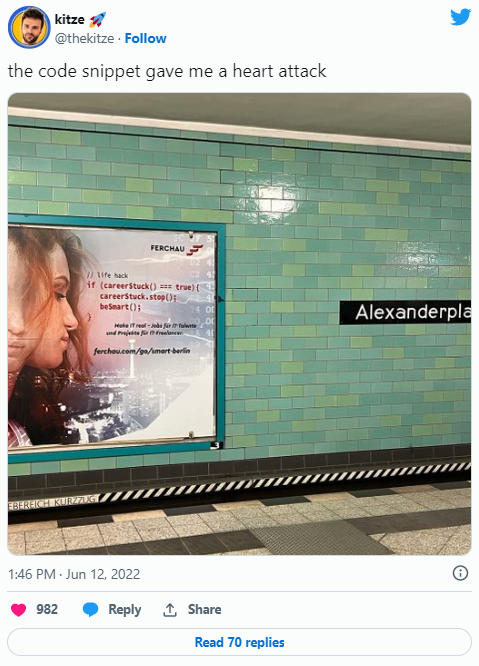
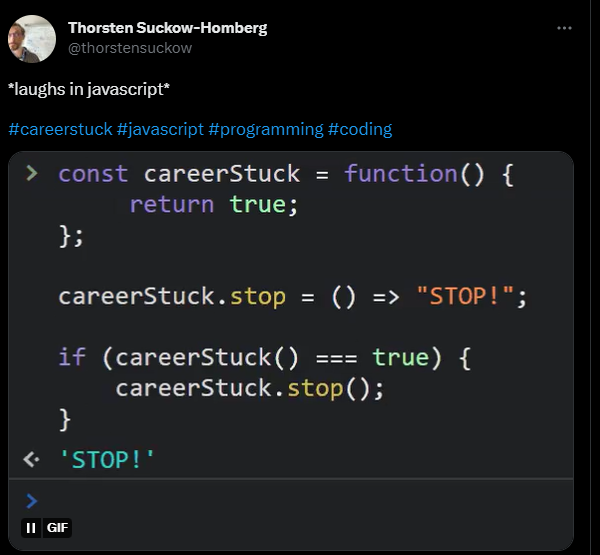

## JavaScript, function-as-object and the internet

The internet ™️ has caught up on an ad by [FERCHAU](https://www.linkedin.com/company/ferchau/), found — amongst others — somewhere within the depths of the Berlin subway.

[](https://twitter.com/thekitze/status/1535951647477846016)


Some devs cringe at the code used with the ad — turns out it can easily get de-mystified with JavaScript’s [function-as-object](http://www.cs.uni.edu/~wallingf/patterns/envoy.pdf) style:

[](https://twitter.com/thorstensuckow/status/1536479447234248708)

```javascript
    const careerStuck = () => {};
    careerStuck.stop = () => {};
```

Opinions regarding semantics may differ:


```javascript
    if (careerStuck() === true) {
        careerStuck.stop();
        beSmart(); // 👀
    }
```

### Further reading

Martin Fowler on **FunctionAsObject** in an [article from 2017](https://martinfowler.com/bliki/FunctionAsObject.html). The pattern goes back to the last century when Eugene Wallingford coined the name “Function as Object” in his [1999 pattern language “Envoy”](http://www.cs.uni.edu/~wallingf/patterns/envoy.pdf).
