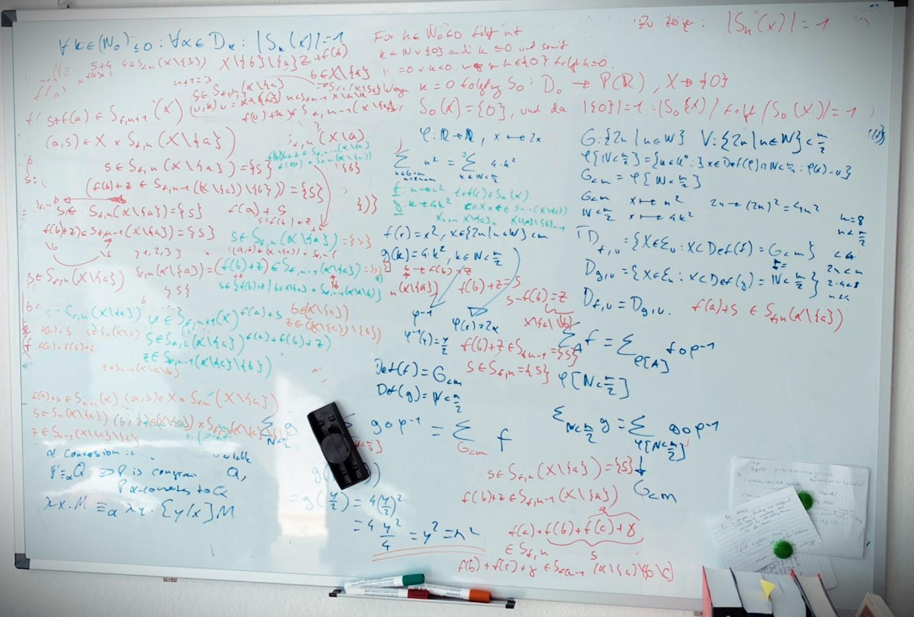

import {GlosRef, BibRef} from "../../src/components/References";
import {BackButton} from "../../src/components/BackButton.js";

Errata für [Beweisen lernen (Springer Verlag 2020)](https://www.math.uni-konstanz.de/mmath/de/book/) von [Junk
](https://www.math.uni-konstanz.de/numerik/personen/junk/) und [Treude](https://www.math.uni-konstanz.de/~treude/vita.html).
Ich hoffe, dass meine Notizen dem Autorenteam zur Überprüfung und ggf. Korrektur nützlich sind.

Zum Hintergrund dieses Blog-Posts gibt es [weiter unten](#hintergrund-aufgabe-178-und-das-kleine-manöver-das-kostete) mehr Informationen.

## Errata

:::info
Stand 21.06.2023. Meine gesammelten Notizen habe ich komplett überführt. Das Kapitel "D Tipps zu den Übungen" wurde von mir nicht bearbeitet.
:::

### Vergleichslösungen

| Seite              | Fehlerstelle                                                                            | Korrekturvorschlag                                                                      | Bemerkung                                                                                                                                                                                                 |
|--------------------|-----------------------------------------------------------------------------------------|-----------------------------------------------------------------------------------------|-----------------------------------------------------------------------------------------------------------------------------------------------------------------------------------------------------------
| 326 (ML261)        | $0 = dist_d(x, A)inf D_{x,A}$                                                           | $0 = dist_d(x, A) = inf D_{x,A}$                                                        |                                                                                                                                                                                                           |
| "                  | $a < inf D_{x,A} + \epsilon$                                                            | $u < inf D_{x,A} + \epsilon$                                                            |                                                                                                                                                                                                           |
| 321 (ML240)        | und $b \in Min(b)$ gegeben                                                              | und $b \in Min(B)$ gegeben                                                              |                                                                                                                                                                                                           |
| 318 (ML230)        | Zu zeigen ist $\exists D \in \R: \forall y,z \in A : d(x,y) \le D$                      | Zu zeigen ist $\exists D \in \R: \forall y,z \in A : d(y, z) \le D$                     | In der ML wird weiter $d(x,y)$ genutzt, obwohl sich der Allquantor auf $y,z$ bezieht. Das wäre im Weiteren zu überprüfen, da wir mit der Def. von $B_r^d(x)$ auch $d(x, y) < r$ verstehen.
| 316 (ML226)        | Wir definieren $g: \N_{\le N} \rarr \R,$...                                             | Wir definieren $g: \N_{\le n} \rarr \R,$...                                             |
| 315 (ML224)        | $d_2(r \cdot u, s \cdot) =$...                                                          | $d_2(r \cdot u, s \cdot u) =$...                                                        |
| 312 (ML214)        | $L_y = \{\alpha - 3\beta, 3\alpha + 2\beta, 0)/11 + t \cdot (0,2,1)\vert t \in \R\}$    | $L_y = \{3\alpha + 2\beta, \alpha - 3\beta, 0)/11 + t \cdot (0,2,1)\vert t \in \R\}$    | $u, v$ vertauscht
| 308 (ML194, Ende)  | Da $r \in [u]_\text{\textasciitilde}$ auf $u \in X$ und $u \text{\textasciitilde} x$... | Da $r \in [u]_\text{\textasciitilde}$ auf $u \in X$ und $u \text{\textasciitilde} r$... |
| 302 (ML178 unten)  | $p(f(b), z) \in P_{f, n-1}(X \setminus \{a\})$                                          | $p(f(b), z) \in P_{f, n}(X \setminus \{a\})$                                            |                                                                                                                                                                                                           |
| 302 (ML178 mittig) | \[Wegen Aufgabe 153 gilt\] $\exists x \in U: P_{f, n}(X \setminus \{x\})$               | $\exists x \in U: P_{f, n}(X \setminus \{a\})$                                          | Die Menge, auf die Bezug genommen wird, ist hier $X \setminus \{a\}$                                                                                                                                      |
| 299 (ML172)        | zeigt Aufgabe 163                                                                       | zeigt Aufgabe **171**                                                                   |                                                                                                                                                                                                           |
| 297 (ML168)        | sei dazu $A \in D_{\alpha \cdot f, n + 1}$                                              | sei dazu $A \in D_{f, n + 1}$                                                           |                                                                                                                                                                                                           |
| 295 (unten)        | $z + f(b) \in S_{n-1}(X \setminus \{a\})$                                               | $z + f(b) \in S_{n}(X \setminus \{a\})$                                                 |
| 288, 289 (ML147)   |                                                                                         |                                                                                         | Es wird auf (3.16) Bezug genommen, aber $\forall n \in \N_{>1}: n - 1 \in \N$ ist Axiom **(3.18)**                                                                                                        |
| 277 (ML106)        |                                                                                         |                                                                                         | für "$\impliedby$" müsste noch $y \in U$ gezeigt werden   
| 272 (ML89)         |                                                                                         |                                                                                         | Es wird auf eine Symmetrie von $\le$ Bezug genommen, aber in dem Kontext ist $\le$ Antisymmetrisch (**Satz 3.11** und Ü89)
| 269 (ML78)         | was auf den Widerspruch $0 \ge 1$ führt                                                 | was auf den Widerspruch $1 \ge 2$ führt                                                 | $x \in \N$, also $x \ne 0$. Im indirekten Beweis wird $x \ge x + 1$ mit $x=0$ verwendet

### Ideen: Metrische Räume

| Seite                 | Fehlerstelle             | Korrekturvorschlag                | Bemerkung                                                                                           |
|-----------------------|--------------------------|-----------------------------------|-----------------------------------------------------------------------------------------------------
| 166 (Ü274)            | $B_r(A)$                 | $B_r^d(A)$                        |                                                                                                     |
| 167                   | $B_r(u)$                 | $B_r^d(u)$                        | Mehrfachnennung auf dieser Seite, ohne auf die Metrik Bezug zu nehmen                               |
| 156 (Ü248)            | $s < sup M$              | $u \in M: u < sup M$              | $s$ ist vorgegeben mit $s \in O_M$, damit gilt ja bereits $s \ge sup M$ und damit auch $s \ge m$    |
| 154 (Ü240)            | $Min(b)$                 | $Min(B)$                          |                                                                                                     |
| 147 (Ü226)            | $D: X^n \times X^n$, ... | $D: X^n \times X^n \rarr \R$, ... |  |

### Ideen: Äquivalenzklassen

| Seite                  | Fehlerstelle                                                                   | Korrekturvorschlag                                                                        | Bemerkung                                                                                          |
|------------------------|--------------------------------------------------------------------------------|-------------------------------------------------------------------------------------------|----------------------------------------------------------------------------------------------------
| 132 (unten)            | $R([a \cdot u]_\text{\textasciitilde}) = R([a \cdot u]_\text{\textasciitilde})$ | $R(a \boxdot [u]_\text{\textasciitilde}) = R([a \cdot u]_\text{\textasciitilde})$         |                                                                                                    |
| 118 **Definition 4.1** | Sei $\text{\textasciitilde}$ eine Äquivalenzrelation auf einer Menge $X$       | Sei $\text{\textasciitilde}$ eine Äquivalenzrelation auf einer **nicht leeren** Menge $X$ |                                                                 |

### Training

| Seite     | Fehlerstelle                                                       | Korrekturvorschlag                                                 | Bemerkung                                                              |
|-----------|--------------------------------------------------------------------|--------------------------------------------------------------------|------------------------------------------------------------------------|
| 94        | $\{t \in U^3: ((t_1 \in A) \land (t_2 \in B)) \land (t_3 \in C)\}$ | $\{t \in U^3: (t_1 \in A) \land (t_2 \in B) \land (t_3 \in C)\}$   |                                                                        | |
| 83 (oben) | führt zur Langform $U = \{y \in \Z: \exists x \in \Z : y = g(z)\}$ | führt zur Langform $U = \{y \in \Z: \exists x \in \Z : y = g(x)\}$ | in (3.10) wird für die Gleichung ebenfalls die falsche Variable genutzt | |
| 82 (Ü102) | Zeige $\exists a \in \R : g [R_{\ge 0}] = \R_{\ge a}$.             | Zeige $\exists a \in \R : g [\R_{\ge 0}] = \R_{\ge a}$.            |  | |

### Rechtschreibung / Grammatik / Druckfehler

| Seite                                               | Fehlerstelle                                                             | Korrekturvorschlag                                                               | 
|-----------------------------------------------------|--------------------------------------------------------------------------|----------------------------------------------------------------------------------|
| 325 (ML259)                                         | Insebsondere ist $dist_d(x,A) = 0$                                       | ~~Insebsondere~~ Insbesondere ist $dist_d(x,A) = 0$                              |
| 295 (ML160)                                         | die Argumentation wurde ist dir eventuell                                | die Argumentation ~~wurde~~ ist dir eventuell                                    |
| 294                                                 | zu zeigen ist $P(A)\mid = 2^{\mid A \mid}$                               | zu zeigen ist $\mid P(A)\mid = 2^{\mid A \mid}$                                  |
| 290                                                 | ergibt $m = \mid n \mid - \mid A \mid \in \N$                            | ergibt $m = n - \mid A \mid \in \N$                                              |
| 284 (ML132)                                         | und mit Aufgabe 132 ergibt sich schliesslich                             | und mit Aufgabe **131** ergibt sich schliesslich                                 |
| 166 (unten)                                         | dass sie sich garnicht scheiden                                          | dass sie sich garnicht ~~scheiden~~ schneiden                                    |
| 149                                                 | In einer Kugel mit em Radius                                             | In einer Kugel mit ~~em~~ dem Radius                                             |
| 125 (unten)                                         | und mit Aufgabe 179 dann                                                 | und mit Aufgabe ~~179~~ 180 dann                                                 |
| 120 (oben)                                          | Mit Teil (b) von Aufgabe 179 folgt hieraus                               | Mit Teil (b) von Aufgabe ~~179~~ 180 folgt hieraus                               |
| 117                                                 | Ausgangspizza in $a_2 \cdot b_2$ Teile auftritt                          | Ausgangspizza in $a_1 \cdot b_2$ Teile auftritt                                  |
| 104 (unten)                                         | in Für-Alle-Aussage über $\N_0$ zu verwandeln                            | in Für-Alle-~~Aussage~~Aussagen über $\N_0$ zu verwandeln                        |
| 102 (oben)                                          | auf $\emptyset$ gibt es nur ein einzige Funktion                         | auf $\emptyset$ gibt es nur ~~ein~~ eine einzige Funktion                        |
| 37 (unten)                                          | Dies folgt durch Anwendung von Satz 2.11 bei Ersetzung von $A$ durch $E$ | Dies folgt durch Anwendung von Satz ~~2.11~~ 2.9 bei Ersetzung von $A$ durch $E$ |
| 37 (unten, folgt der vorher erwähnten Fehlerstelle) | Dies folgt durch Anwendung von Satz 2.9 bei Ersetzung                    | Dies folgt durch Anwendung von Satz ~~2.9~~ 2.11 bei Ersetzung                   |
### Anmerkungen

| Seite                    | Bemerkung                                                                                            |
|--------------------------|------------------------------------------------------------------------------------------------------
| 148 **Definition 5.9**   | vielleicht bietet es sich hier bereits an, in der Definition den Begriff "offene Kugel" zu verwenden |
| 91 **Definition 3.24** | Informatiker würden sich hier über die Erwähnung "partielle Funktion" freuen                         |

*ML = Musterlösung

*Ü = Übung

## Hintergrund: Aufgabe 178 und das kleine Manöver, das kostete

In der Lösung zu **Aufgabe 178** aus [Beweisen lernen](https://www.math.uni-konstanz.de/mmath/de/book/) - und der hierzu vorbereitenden **Aufgabe 158** - bin ich bei der Nachbereitung des Lösungsvorschlages nicht zu dem gleichen Ergebnis gekommen - der Definitionsbereich einer Funktion wurde falsch angegeben. Den Versuch, die Falschaussage nachzuweisen, habe ich hier in diesem Post dokumentiert. 

Weitere Notizen bzgl. eventueller Fehler hinsichtlich Logik- und Druck fasse ich in dem o.a. [Errata](#errata) zusammen. 

## Aufgabe 158

##### Notation
$U$: Elementuniversum

$\Epsilon_n$: Menge aller endlichen Mengen mit der Mächtigkeit $n$

$P(K)$: Potenzmenge von $K$ mit $K \subset U$

### Aufgabenstellung
Es ist per Induktion zu beweisen, das

$\forall n \in \N_0: \forall k \in (N_0)_{\le n}: \forall X \in D_k: | S_k(X)| = 1$

Folgendes steht mit den Voraussetzungen zur Verfügung:

$f: X \mapsto R$

$D_n:=\{X \in \Epsilon_n : X \subset Def(f) \}$

$S_0: D_0 \to P(\R),\space X \mapsto \{0\}$

$S_{n+1}: D_{n+1} \to P(\R),\space X \mapsto \{f(x) + s \space | \space (x, s) \in X \times S_{n}(X \setminus \{x\})\}$

### Induktionsschritt
Die Autoren wollen die Eindeutigkeit des Elementes $x \in U: x \in S_{n+1}(X)$ über

$\exists! x \in U: x \in S_{n+1}(X)$

zeigen. Hierzu muss die Existenz und die Eindeutigkeit des Elementes gezeigt werden, so dass wegen $\forall u,v \in S_{n+1}(X): u = v$
auch $|S_{n+1}(X)| = 1$ folgt (u.a. wegen **Aufgabe 99** und **Aufgabe 153**).

### Argumentation
Hierzu sei

$u:= f(a)+s, v:= f(b)+t$

Die Autoren zeigen einige Schritte weiter, dass mit der Induktionsvoraussetzung für $s$ folgt:

Da $f(a) + s \in S_{n+1}(X)$, ist $s \in S_n(X \setminus \{a\})$.

Mit $b \in X \setminus \{a\}$ soll dann $s = f(b) + z$ gezeigt werden, wobei wieder die Induktionsvoraussetzung angewendet wird und $z \in S_{n-1}(X \setminus \{a\} \setminus \{b\})$ gefunden wird.

### Fehlerstelle
In einem weiteren Schritt wird dann behauptet, dass $f(b) + z \in S_{n-1}(X \setminus\{a\})$ ist, und deswegen $f(b)+z \in \{s\}$ und folglich $f(b) + z = s$. Das scheint der Fehler zu sein, denn für $s$ wurde gezeigt: $s \in S_n(X \setminus \{a\})$:

Wenn $s \in S_n(X \setminus \{a\})$ und $s \in S_{n-1}(X \setminus\{a\})$ gelten würde, dann würde für

$f(c)+s \in S_n(X \setminus \{a\})$ und $f(b)+t \in S_{n-1}(X \setminus \{a\})$ auch $f(c)+s = f(b)+t$ gelten (für $c, b \in X \setminus \{a\}$).

Da $s = f(b) + t$ wegen $f(b) + t \in S_{n-1}(X \setminus \{a\})$ und $s \in S_{n-1}(X \setminus\{a\})$ folgt dann auch
$f(c) + s = s$, was im Widerspruch zu $f(c) + s = f(c) + s$ steht und offensichtlich nicht $\forall c \in X \setminus \{a\}$ gilt.

