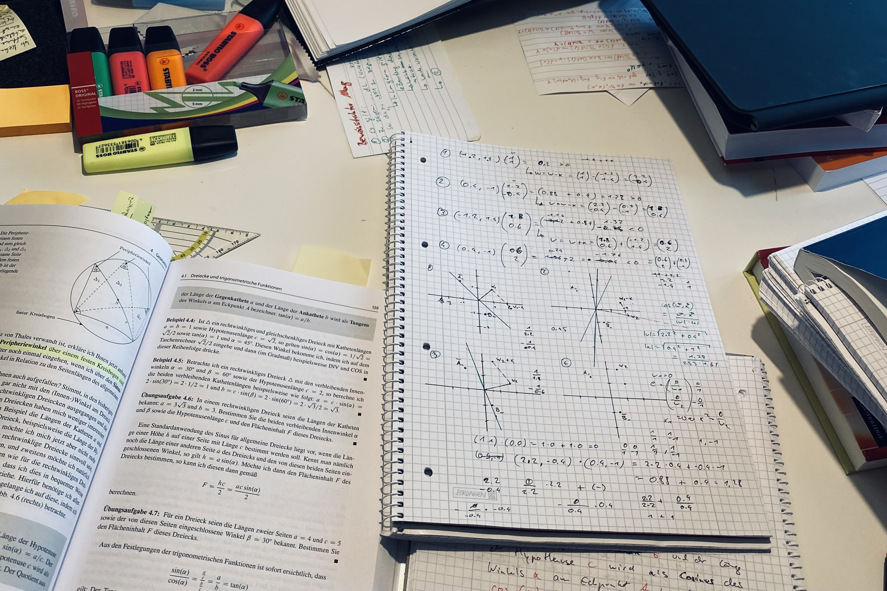

import {GlosRef, BibRef} from "../../src/components/References";
import {BackButton} from "../../src/components/BackButton.js";

:::info
Man darf behaupten, dass im Jahr 2023 das Thema **Künstliche Intelligenz** endgültig [in der Gesellschaft angekommen ist](https://wikimediafoundation.org/news/2023/12/05/announcing-wikipedias-most-popular-articles-of-2023/). Mit der Veröffentlichung von ChatGPT Ende 2022 ist "KI" plötzlich für jeden ~~be~~greifbar. Einmal mehr rutschen [defätistische Prophezeiungen auf die Titelseiten der Boulevard-Presse](https://www.bild.de/news/ausland/news-ausland/experten-warnen-ki-so-gefaehrlich-wie-pandemien-und-atomkrieg-84130180.bild.html).

 Für mich ist _Künstliche Intelligenz_ in all seinen Ausprägungen bis zu diesem Zeitpunkt wenig begreifbar gewesen. Als Software Entwickler mit Schwerpunkt Design und Architektur hatte ich es weitestgehend in den akademischen Bereich verortet.

Dann hatte ich das Glück, mich ausgiebig mit Künstlicher Intelligenz im Rahmen meiner [Zulassungsarbeit](https://www.hochschule-trier.de/informatik/fernstudium/studium/masterfernstudium/mcsc-zulassung/informationen-zur-eignungspruefung/eignungspruefung-inhalt) für den Fernstudiengang Informatik (M.C.Sc.) an der [FH Trier](https://www.hochschule-trier.de/) beschäftigen **zu müssen**.

 Entstanden ist eine Arbeit, in dem ich mathematische Modelle künstlicher Neuronen vorstelle. Auf dem Weg dorthin bin ich in die frühen Anfänge der Neurowissenschaft, der Kybernetik und Rechnerarchitektur eingetaucht. Es hat meine Sichtweise auf vieles, was mir bis dahin (un)verständlich gewesen ist, geändert.

 Für meine Kommilitonen, die die Eignungsprüfung noch vor sich haben, habe ich in diesem Post meine Erfahrungen zum Thema _Wissenschaftliches Arbeiten_ zusammengefaßt.
:::

## Thema
Für 2023 stand die [Zulassungsarbeit zum Master-Fernstudiengang Informatik](https://www.hochschule-trier.de/informatik/fernstudium/studium/masterfernstudium/mcsc-zulassung/informationen-zur-eignungspruefung/eignungspruefung-inhalt) an der [FH Trier](https://www.hochschule-trier.de/)
unter dem Thema **Funktionsprinzipien und Anwendung künstlicher Intelligenz (KI) in der Medizin**.

Das Thema wurde Ende Mai 2023 bekannt gegeben, als Bearbeitungszeitraum wurde der 01.07. - 02.10.2023 vorgegeben.

## Vorbereitung

Zur Einarbeitung in das Thema hat mir **Grundkurs Künstliche Intelligenz** <BibRef name="Ert21" /> von [Prof. Dr. Wolfgang Ertel](https://www.hs-weingarten.de/~ertel/de) (Hochschule Ravensburg-Weingarten) geholfen. Das Buch hat mich auf die (formalen) Grundlagen der Aussagenlogik und Prädikatenlogik vorbereitet sowie einführend maschinelles Lernen und Neuronale Netze erklärt, was mir die anschliessende Arbeit mit [Russel](https://people.eecs.berkeley.edu/~russell/) & [Norvig](https://www.norvig.com/)'s <BibRef name="RN12" /> erleichterte. Das Standardwerk zum Thema **Künstliche Intelligenz**  geht detailliert (in Teilen auch sehr formal) auf Agentenmodelle, Problemlösungen, Logik, Entscheiden und Lernen ein.

Da nicht nur Künstliche Intelligenz als Thema vorgeben gewesen ist, sondern auch _Medizin_, habe ich darüber hinaus <BibRef name="Pfa22" /> (quer)gelesen, um mir einen Überblick über die verschiedenen Anwendungsgebiete von KI im Gesundheitswesen zu verschaffen. Ergänzend dazu habe ich mit großem Interesse den Podcast [Dr. med. KI](https://www.ki-campus.org/podcasts/drmedki) von [Prof. Dr. Kerstin Ritter](https://psychiatrie-psychotherapie.charite.de/metas/person/person/address_detail/prof_dr_rer_nat_kerstin_ritter/) (Charité Berlin) und [Mike Bernd](https://stifterverband.org/ueber_uns/mitarbeiter/bernd_mike) (Stifterverband für die Deutsche Wissenschaft e.V.) verfolgt, in dem Themen aus den Bereichen Medizin, Informatik und Ethik zusammengefasst und Hintergründe, Problematiken und Ausblicke in Zusammenhang mit KI diskutiert werden.

## Eingrenzung des Themas und Ausarbeitung
Im Juli des gleichen Jahres habe ich dann mit der Ausarbeitung begonnen, das Thema hatte ich - noch etwas unscharf - auf den Einsatz von KI bei bildgebenden Verfahren in der Medizin eingegrenzt. Da hier KI überwiegend in Form neuronaler Netze stattfindet, musste ich mich also noch in dieses Thema einarbeiten: Während die Vorbereitung im Juni also das Verständnis um Künstliche Intelligenz geschärft hatte, wurde mir schnell klar, dass das ein bloßes Kratzen an der Oberfläche gewesen ist. Um Modelle neuronaler Netze nachvollziehen zu können, musste ich zunächst das biologische Vorbild verstehen, was mich zu den Neurowissenschaften führte.

Die Literatur, die ich bis zu diesem Zeitpunkt durchgearbeitet habe, hatte meinem Empfinden nach die tierische Nervenzelle als Mittel zum Zweck gesehen: Signalweiterleitung und verrechnende Einheiten in einem neuronalen Netze wurde zwar als Abstraktion biochemischer Vorgänge im Gehirn verstanden, aber das **warum** und **Wie** wurde wenig ausführlich erklärt.

Es war mir also ein großes Anliegen,die komplexen biochemischen Vorgänge im Nervensystem zu verstehen und als fachlichen Hintergrund der Arbeit voranzustellen, um die großen Erfolge, die der Einsatz Künstlicher Intelligenz in den letzten Jahren in der Medizin vorweisen konnte, dem Leser besser verständlich zu machen.

Folglich legte ich das Thema meiner Arbeit fest:

**Eine Einführung in mathematische Modelle der biologischen Nervenzelle als Bausteine künstlicher neuronaler Netze und deren Anwendung im Gesundheitswesen**.

Es sollte die Signalweiterleitung im biologischen Neuron erklären, erste, frühe Modelle künstlicher Neuronen vorstellen, den Bogen zu künstlichen neuronalen Netzen spannen und dann Anwendungsbeispiele aus dem Gesundheitswesen aufführen.

## Abgabe und Bewertung
Ich hatte damit begonnen, erste Entwürfe in Markdown zu schreiben, damit mir eine spätere Überführung der Arbeit in eine lesbare Form auf meine Webseite erleichtert wird. Die Hochschule stellt Word- und Latex-Vorlagen zur Verfügung - die ich im Anschluss für eine Portierung nutzen wollte.

Als ich mit dem ersten Entwurf meiner Arbeit  - ca. Mitte September - fertig war, hatte ich nach Korrektur und meiner (bescheidenen) Zählweise nach gut und gerne 20 - 30 DIN A4 Seiten Text (ohne Illustrationen und Tabellen) - an der Stelle war mir aber schon klar, dass ich den ein oder anderen Abschnitt eher ausführlich als kompakt beschrieben habe, weshalb ich noch eine Woche Lektorat eingeplant hatte.

Nach der Überführung in Latex, die ca. eine Woche gedauert hat, zählte ich - unter Verwendung der Vorlage, die Trier zur Verfügung gestellt hat, ca. 80 Seiten - ohne Inhalts-, Literatur- und Abbildungsverzeichnis. Das Lektorat umfasste also nicht nur inhaltliche und formale Korrekturen, sondern teilweise auch das komplette Umschreiben des ein oder anderen Kapitels, weil viel Stoff in den Anhang wechseln musste: Vor allem Biografien von Persönlichkeiten, die sich in Forschung und Wissenschaft um das Thema verdient gemacht haben, sowie Begriffe und Ergänzungen rund um das Thema Neurobiologie.

Die korrigierte Fassung, die als Vorlage der finalen Abgabeversion diente, umfasste dann knapp 45 Seiten, mit ungefähr 50 Seiten Anhang.

Für die Abgabeversion wurde also noch einmal inhaltlich soweit gekürzt, dass die Intention einer "Einführung" weitestgehend erhalten blieb - mir war aber auch klar, dass eine Arbeit, die Neurobiologie, Neurowissenschaften, Informatik, Mathematik und Medizin unter dem Thema "Künstliche Intelligenz" auf 20 (Vorgabe Prüfungsausschuss) Seiten zusammenfasst, keine Einführung mehr sein kann. Die Abgabeversion wurde kurzum umbenannt in

**Mathematische Modelle der biologischen Nervenzelle als Bausteine künstlicher neuronale Netze und deren Anwendung im Gesundheitswesen**

und umfasst 30 Seiten, inkl. Tabellen und Illustrationen. Der Anhang ist komplett entfallen, Fußnoten, die in der Ursprungsversion zahlreich vorhanden sind und viele Ergänzungen bieten, rausgekürzt.

Die Abgabeversion entsprach somit den formalen Vorgaben, was sich auch in der Bewertung der Arbeit widerspiegelte.

## Download

Die Arbeit liegt in zwei Versionen vor: Eine ausführliche Ausarbeitung der wichtigen Themen, die einen einführenden Charakter besitzt, sowie die gekürzte Fassung, die den formalen Vorgaben entspricht.

In beide Versionen wurden bereits Anmerkungen und Korrekturen aus dem Errata übernommen. Glücklicherweise beschränkten sich diese weitestgehend auf wenige Fehler in der Orthographie und einen Fehler in der formalen Herleitung des McCulloch-Pitts-Netzes als Graph in Abschnitt 3.1.4 (ungekürzte Version, entfallen in der Abgabeversion).

 - [Download ungekürzte Version (pdf)](/pdf/einfuehrung-in-mathematische-modelle-der-biologischen-nervenzelle-als-bausteine-kuenstlicher-neuronaler-netze.pdf)
 - [Download gekürzte Abgabeversion (pdf)](/pdf/zulassungsarbeit-eignungspruefung-informatik-fh-trier-2023.pdf)
