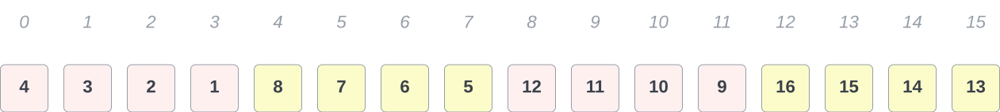
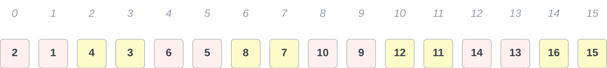
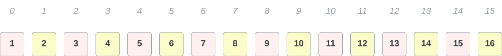
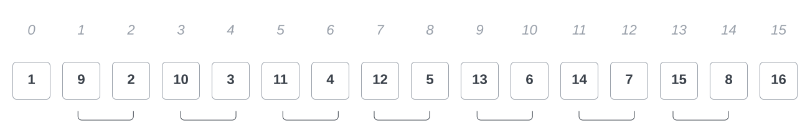
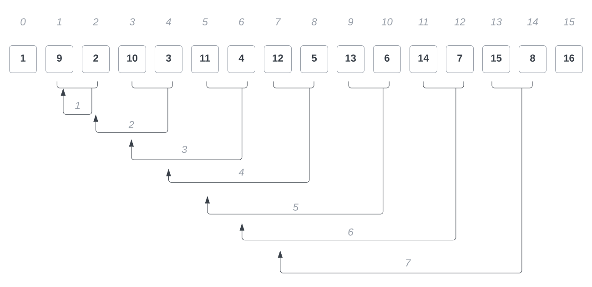

# Laufzeit Analyse anhand des Shellsort-Algorithmus


import {BackButton} from "../../../src/components/BackButton.js";
import {UmlEmbed, Embed} from "../../../src/components/Embed";
import {GlosRef, BibRef} from "../../../src/components/References";


**Shellsort** ist ein Sortieralgorithmus, der nach *Donald Shell* benannt wurde. Er wurde von ihm 1959 in <BibRef name="She59" /> vorgestellt.

Die in dem Algorithmus verwendete Sortiermethode ist auch bekannt als
*Sortieren mit abnehmenden Inkrementen* <BibRef name="OW17b" pp="88" />, das Verfahren ist eine Variation von **Insertion Sort**:

> [Shellsort] uses insertion sort on periodic subarrays of the input
> to produce a faster sorting algorithm. <BibRef name="CL22" pp="48" />


In der vorliegenden Implementierung [Listing 1](#lst:1) werden $t = log_2(n)$ Inkremente[^1]
$h_t$[^2] der Form $\lfloor {\frac{n}{2^i}} \rfloor$ verwendet, um $lg(n)$
$h$-sortierte Folgen zu erzeugen. Im letzten Schritt sortiert der
Algorithmus dann in $h_1$ die Schlüssel mit Abstand=$1$.

Die Effizienz des Sortierverfahrens ist stark abhängig von $h$: So zeigt
*Knuth*, dass $O(n^{\frac{3}{2}})$ gilt, wenn für $h$ gilt:
$h_s = 2^{s+1} - 1$ mit $0 \leq s < t = \lfloor{lg(n)} \rfloor$ (vgl.  <BibRef name="Knu97c" pp="91" />[^3]. In unserem Fall können wir von $O(n^2)$ ausgehen.


### Anzahl der Aufrufe für Feldvergleiche

Gesucht ist die Anzahl der zwischen zwei Feldelementen gemachte Vergleiche für große randomisierte Felder.
Wir vermuten hierfür einen Wert zwischen $O(n\ lg\ n)$ und $O(n^2)$,

Um die Aufrufe der Feldvergleiche zu zählen, kann wie in [Listing 1](#lst:1) eine Zählvariable $c3$ eingesetzt wird, die
jeden Aufruf über ein *increment* protokolliert.

<a name="lst:1"></a>

```java title="Listing 1: Zur Protokollierung der Aufrufe können in dem Code Zählvariablen eingesetzt werden (c1, ... ,c4)." {2, 5, 7, 9} showLineNumbers
while (distanz > 0) {
    c1++;
    for (i = distanz; i < feld.length; i++) {
        j = i - distanz;
        c2++;
        while (j >= 0) {
            c3++;
            if (feld[j] > feld[j + distanz]) {
                c4++;
                swap(feld, j, j+distanz);
                j = j - distanz;
            } else {
                j =-1;
            }
        }
    }
    distanz = distanz / 2;
}
```

Zur Bestimmung von $c3$ können randomisierte Felder erzeugt werden, wie
es der Test-Code in [Listing 2](#lst:2) demonstriert. Dann wird überprüft, in welchen Bereichen sich $c3$ bewegt.
Da jeder auf Vergleichsoperationen basierende Sortieralgorithmus zu der Laufzeitklasse $\Omega(n\ log\ n)$
gehört, kann im Mittel $c3 \geq n\ log\ n$ angenommen werden:

> Jedes allgemeine Sortierverfahren benötigt zum Sortieren von N
> verschiedenen Schlüsseln sowohl im schlechtesten Fall als auch im
> Mittel wenigstens $\Omega(N\ log\ N)$ Schlüsselvergleiche.
>
>  <BibRef name="OW17b" pp="154" />


Allerdings wird $n^{1.3}$ ab $n=982$ schneller wachsen als $n\ log\ n$
(siehe [Abbildung 1](#fig:lognplot)), was in der Auswertung berücksichtigt
werden muss. Sonst könnte man fälschlicherweise folgern, das in dem geg.
Fall die Laufzeit im Durchschnitt $n\ log\ n$ beträgt.

<a name="lst:2"></a>

```java title="Listing 2: Code zum Erzeugen randomisierter Felder zum Testen von Shellsort." showLineNumbers
int epochs = 2000;
while(epochs-- >= 0) {
    int[] tests = new int[]{10, 100, 1000, 100_000, 1_000_000};
    java.util.Random r = new java.util.Random();
    for (int i = 0; i < tests.length; i++) {
        int l = tests[i];
        int[] arr = new int[l];

        for (int j = l; j > 0; j--) {
            arr[l - j] = r.nextInt(l + 1);
        }

        ShellSort.sort(Arrays.copyOfRange(arr, 0, arr.length));
    }
}
```

:::info
Mit einem Wert von $100$ für die Epochen und einer Feldgröße von
$2.000.000$ liefert der Test in [Listing 2](#lst:2) folgende Ausgabe:

$nlgn < n^{1.3} < x < n^2: 74$\
$nlgn < x < n^{1.3}: 26$
:::


import LognPlotPng from "./img/lognplot.png";

<a name="fig:lognplot"></a>
<Embed
    modeAware={true}
    width={640}
    figure={1}
    title={"Ab <i>n=982</i> wächst n<sup>(4/3)</sup> schneller al <i>n log n</i>." }
></Embed>


Wegen $\Omega(n\ log\ n)$ interessieren wir uns für die Intervalle:

-   $n\ log\ n \leq c3 \leq n^{1.3}$

-   $n\ log\ n \leq n^{1.3} \leq c3 \leq n^2$

Die Ausführung des Tests zeigt, dass die Aufrufanzahl von $c3$ bei
großen $n$ unterhalb $n^{1.3}$ oder zwischen $n^{1.3}$ und $n^2$ liegt:

> It appears that the time required to sort $n$ elements is proportional
> to $n^{1.226}$.[^4]
>
> <BibRef name="She59" pp="31" />

## Laufzeitanalyse

Für die nachfolgenden Betrachtungen sei eine Eingabegröße $n = 2^p$
gegeben. Die Inkremente $h$ entsprechen der über die Implementierung
vorgegebenen Folge $h$ mit
$h_t = \frac{n}{2}, h_{t-1} = \frac{n}{4}, \dots, h_1 = 1$.

Für die Analyse ist die **Shellsort**-Implementierung in
[Listing 3](#lst:shellsort) gegeben.

<a name="lst:shellsort"></a>

```java title="Listing 3: Implementierung des Shellsort-Algorithmus." showLineNumbers
public static int[] sort(int[] arr) {

    int n = arr.length;
    int delta = n/2;
    int min;
    int j;

    while (delta > 0) { // c1

        for (int i = delta; i < arr.length; i++) {

            // c2

            min = arr[i];
            j = i;

            while (j - delta >= 0 && min < arr[j - delta]) {

                // c3;

                arr[j] = arr[j - delta];
                j -= delta;
            }
            arr[j] = min;
        }

        delta = delta / 2;

    }
    return arr;
}
```

Im Folgenden betrachten wir die Anzahl für die im Code durch Kommentare
markierten Stellen $c1$ in Zeile 8, $c2$ in Zeile 12 und $c3$ in Zeile
19.


Für eine erste *worst-case*-Analyse ist ein Feld der Länge $16$ gegeben,
in absteigender Reihenfolge sortiert (s. [Abbildung 2](#fig:bestcase)):


import BestcaseSequence from "./img/bestcase-sequence.png";

<a name="fig:bestcase"></a>
<Embed
    modeAware={true}
    figure={2}
    title={"Die für die Laufzeitabschätzung verwendete Eingabefolge <i>16..1</i>." }
></Embed>


Ganz offensichtlich gilt für **c3**, dass es $lg(n)$-mal aufgerufen
wird[^5].
**c2** befindet sich im Block der durch die in Zeile 11 definierten
Zählschleife.

Der Startwert für `i` ist in jedem Durchgang des Blocks $c1$ der aktuelle
Wert von `delta` [^6], und läuft jeweils bis $n - 1$.

In einem kompletten Durchlauf der Schleife entspricht die Anzahl der
Aufrufe von $c2$ also

$(n - 1) - delta + 1 = n - delta$

:::info
**Hinweis:**
Für das Beispiel betrachten wir der Einfachheit halber Feldlängen der
Form $2^p$.
Für den allgemeinen Fall gilt für die Anzahl der Aufrufe von $c2$:
$\sum_{i=1}^{\lfloor lg(n) \rfloor} n - \lfloor \frac{n}{2^i} \rfloor = n * lg(n) - \sum_{i=1}^{\lfloor lg(n) \rfloor} \lfloor \frac{n}{2^i} \rfloor$
:::

Für die Gesamtzahl der Aufrufe von $c2$ ergibt sich somit unter
Berücksichtigung von $c1$

$$\sum_{i=1}^{lg(n)} n - \frac{n}{2^{i-1}}$$

was nach Auflösen

$$n * lg(n) - n + 1$$

entspricht, und für unser Beispiel

$$16 * lg(16) - 16 + 1 = 49$$

ist.

:::info
  Die Aufrufzahlen für $c2$ für verschiedene $n$. Schlüsselvergleiche finden erst später statt.
  Mit $n > 2156$ wächst $O(n^\frac{4}{3})$ schneller als $c2$ und mit $n >= 982$ schneller als
  $O(n\ log\ n)$.


|   **n**   |   **c2**   | **$O(n^{1.1})$** | **$O(n^{1.3})$** | **$O(n\ log\ n)$** | **$O(n^2)$**  |
|:---------:|:----------:|:---------------:|:---------------:|:-------------------:|:------------:|
|     8     |     17     |        9        |        14       |          24          |      64      |
|    16     |     49     |       21        |        36       |          64          |     256      |
|    32     |    129     |       45        |        90       |         160          |    1024      |
|    64     |    321     |       97        |       222       |         384          |    4096      |
|   128     |    769     |      207        |       548       |         896          |   16.384     |
|   256     |   1793     |      445        |      1351       |        2048          |   65.536     |
|   1024    |   9217     |      2048       |      8192       |       10240          | 1.048.576    |
|   2156    |   21.565   |    4.645,29     |    21.564,69    |      23.875,84       | 4.648.336    |
|   2157    |   21.576   |    4.647,66     |    21.577,70    |      23.888,36       | 4.652.649    |
|   2158    |   21.586   |    4.650,03     |    21.590,70    |      23.900,88       | 4.656.964    |
|   ...     |    ...     |      ...        |       ...       |         ...          |     ...      |
|  10.000   |  120.005   |     25.118      |     158.489     |       132.877        |    1.0E8     |
| 100.000   | 1.500.006  |     316.227     |    3.162.277    |      1.660.964      |    1.0E10    |
| 200.000   | 3.200.006  |     677.849     |    7.786.440    |      3.521.928      |    4.0E10    |
| 500.000   | 8.500.007  |   1.857.235     |    2.56..E7     |      9.465.784      |    2.5E11    |
| 1.000.000 | 18.000.007 |   3.981.071     |    6.30..E7     |      1.99..E7       |    1.0E12    |

:::

In der `while`-Schleife in Zeile 17 findet die eigentliche
Arbeit des Algorithmus statt: Es wird überprüft, ob $delta$-entfernte
Elemente in aufsteigender Reihenfolge sortiert angeordnet sind.

Ist das nicht der Fall, werden die Elemente an den Stellen $j$ und
$j - delta$ ausgetauscht, bis die $h$-Folge sortiert ist.

Für den ersten Durchgang des Algorithmus an dieser Stelle mit $h_4 = 8$
ergibt sich somit die in [Abbildung 3](#fig:bestcase-it1) dargestellte Reihenfolge der Schlüssel:


import BestcaseIt1 from "./img/bestcase-it1.png";

<a name="fig:bestcase-it1"></a>
<Embed
    modeAware={true}
    figure={3}
    title={"Nach dem ersten Durchgang sind die Schlüssel in den Abständen <i>h_4 = 8</i> sortiert, es ergeben sich zwei sortierte Teilfolgen der Länge <i>8</i>." }
></Embed>


Die weiteren Durchgänge des Algorithmus sortieren das Feld entsprechend
der Größe $h$: Es sind danach jeweils Schlüssel mit den Abständen $4$
(Abbildung [4](#fig:bestcase-it2){reference-type="ref"
reference="fig:bestcase-it2"}), $2$
(Abbildung [5](#fig:bestcase-it3){reference-type="ref"
reference="fig:bestcase-it3"}), und im letzten Schritt vollständig
sortiert (Abbildung [6](#fig:bestcase-it4){reference-type="ref"
reference="fig:bestcase-it4"}):

{#fig:bestcase-it2}
Die Sortierung für $h_3 = 4$, es sind 4 Folgen, deren Schlüssel
jeweils den Abstand $4$ haben.


{#fig:bestcase-it3}
Im vorletzten Sortierschritt sind $8$ Folgen der Länge $2$ sortiert.


{#fig:bestcase-it4}
Der letzte Durchgang des Algorithmus vergleicht Schlüssel mit
Distanzfolgen der Länge $1$, also direkt benachbarte Schlüssel.

\
Für die Berechnung der Anzahl der Aufrufe von $c3$ stellt man fest, das
in diesem Fall in jedem Schritt *immer* 2 Elemente, die eine Distanz von
$h_s$ aufweisen, falsch sortiert sind.

Der Algorithmus tauscht also in diesem Fall in jedem Durchgang alle
Schlüssel untereinander aus, die er über miteinander vergleicht, was
folglich die maximale Anzahl von Schlüsselvertauschungen in dieser
vergleichsbasierten Implementierung für ein Feld der Größe $n$ ergibt,
nämlich $\frac{n}{2}$. Insgesamt finden dadurch für $c3$

$$lg(n) * \frac{n}{2}$$

Aufrufe statt.

Mit der Anzahl der berechneten Aufrufe $c1, c2, c3$ ergibt sich somit
für die Laufzeit $T(n)$ für diesen Fall

$$lg(n) + n * lg(n) - n + 1 +  lg(n) * \frac{n}{2}$$

und zusammengefasst

$$\label{eq:bestcase}
 f(n) = \frac{3}{2} * n * lg(n) + lg(n) - n + 1$$

was nach Einsetzen zu

$$lg(16) + 16 * lg(16) - 16 + 1 +  lg(16) * \frac{16}{2} = 85$$

Aufrufen für unser Beispiel führt.\

## Nachweis der Komplexitätsklasse {#nachweis-der-komplexitätsklasse .unnumbered}

Um $O$ zu ermitteln, werden nun alle Konstanten der
Funktion [\[eq:bestcase\]](#eq:bestcase){reference-type="ref"
reference="eq:bestcase"} eliminiert, und der "dominante" Summand in
Abhängigkeit von $n$ betrachtet, der in diesem Fall $lg(n) * n$ ist.

Wir vermuten ein $N-log-N$-Wachstum[^6] (vgl. [@OW17a 5]), und wollen
nun zeigen, dass $T(n)$ in $O(n\ log\ n)$ liegt.\
Hierfür müssen wir ein geeignetes $c$ und ein $n_0$ finden, so dass
gilt:

$$f \in O(n\ log\ n): \leftrightarrow \exists n_0 \in \mathbb{N}, c \in \mathbb{R}, c > 0: \forall n \geq n_0: f(n) \leq c * n*lg(n)$$

(vgl. [@GD18a 11]).

::: proof
*Proof.* []{#pr:nlogn label="pr:nlogn"}\
Zu zeigen ist
$$\frac{3}{2} * n * lg(n) + lg(n) - n + 1 \leq c * n * lg(n)$$

Wir wählen für $n_0 = 1$ und $c = \frac{3}{2}$, denn es gilt sicher
$\forall n \geq n_0: \frac{3}{2} * n * lg(n)  \leq \frac{3}{2} * n * lg(n)$.

Ausserdem gilt stets $\forall n \in \mathbb{N}: lg(n) < n$, woraus
$lg(n) - n < 0$ folgt, und damit auch $lg(n) - n + 1 \leq 0$.\
Insgesamt gilt also

$$n_0 = 1, c = \frac{3}{2}: \forall n \geq n_0: \frac{3}{2} * n * lg(n) + lg(n) - n + 1 \leq c * n * lg(n)$$

womit $f = O(n * log(n))$ gezeigt ist. ◻
:::

## Worst-Case-Analyse {#worst-case-analyse .unnumbered}

Unter der Annahme, dass ein in umgekehrter Reihenfolge sortiertes Feld
zu einer Laufzeit von $O(n^2)$ bei dem **Shellsort**-Algorithmus führt,
konnten wir mit dem in dem vorherigen Abschnitt gewählten Parametern nur
eine Laufzeit von $O(n\ log\ n)$ nachweisen.\
Tatsächlich stellt der Anwendungsfall nicht den worst-case für den
Algorithmus dar, da ja gerade diese Form von Sortierreihenfolge dem
Algorithmus die Vorsortierung der $h$-Folgen ermöglicht:\

> The idea underlying Shellsort is that moving elements of A long
> distances at each swap in the early stages, then shorter distances
> later, may reduce this $O(n^2)$ bound.
>
> [@Pra72 3]

\
Es gilt also, die Vorsortierung auszuhebeln.\
Für **Insertion-Sort** ist die Laufzeit im worst-case $O(n^2)$
(vgl. [@OW17b 87]). Da Shellsort mindestens im letzten Schritt diese
Sortiermethoden auf Distanzfolgen der Länge $1$ anwendet, muss der
Algorithmus eine Folge als Eingabe erhalten, die durch die ersten
$lg(n) - 1$-Durchgänge (mit $h_s = 2^{s - 1}, 1 <= s < lg(n)$)
[keine]{.underline} Änderungen an der Schlüsselfolge vornimmt, um dann
im allerletzten Schritt [alle]{.underline} Daten zu sortieren, was
maximal $\frac{n}{2}$ Inversionen bedeutet zuzüglich der benötigten
Verschiebe-Operationen.\
Hierzu kann wie im vorherigen Beispiel für $n=16$ ein Feld mit folgender
Schlüsselanordnung verwendet werden: Felder mit geradem Index enthalten
kleinere Schlüssel als Felder mit ungeradem Index. Hier gilt für alle
Elemente aus dem Feld $A$:

$$\forall i, j \in \mathbb{N}_{[0, n - 1]}, 2 \mid i, 2 \nmid j:  A[i] < A[j] \land A[i] < A[i + 1] \land A[j] < A[j +1]$$

Abbildung [7](#fig:worstcase-sequence){reference-type="ref"
reference="fig:worstcase-sequence"} veranschaulicht die Anordnung.

{#fig:worstcase-sequence}
Eine *worst-case* Schlüsselfolge für Shellsort. Felder mit geradem
Index enthalten kleinere Schlüssel als Felder mit ungeradem
Index.

Markiert sind die direkt benachbarten Felder, die eine *Inversion*
aufweisen[^7], die im letzten Schritt des Algorithmus eine bzw. mehrere
Verschiebungen bedingen.\
In den vorherigen Schritten - also bei den Durchgängen mit Distanzfolgen
$h_s > 1$, findet der Algorithmus jeweils Schlüssel in korrekter
Sortierreihenfolge vor.

Mit $h_4 = 8$ werden die Felder $A[0..7]$ mit den Feldern $A[8..15]$
verglichen - hier gilt in jedem Fall, dass die Schlüssel
$A[i] < A[j] (\forall i < j, j - i = 8)$ sind.

Auch im darauffolgenden Durchgang ($h_3 = 4, j - i = 4$) finden keine
Verschiebungen statt, da keine Inversion gefunden wird. Erst im letzten
Schritt, in dem direkt benachbarte Elemente miteinander verglichen
werden, werden die Inversionen ermittelt und die Verschiebung der
Elemente findet statt (s.
Abbildung [8](#fig:worstcase-sortsequence){reference-type="ref"
reference="fig:worstcase-sortsequence"}).

{#fig:worstcase-sortsequence}
Für die *worst-case* Schlüsselfolge werden im letzten Schritt 7
Fehlstellungen festgestellt. Jede Fehlstellung bedingt eine Verschiebung
um die angegebene Anzahl von
Positionen.

In diesem Fall wird $c3$ insgesamt $32$ mal aufgerufen.\
Da jeweils zwei Schlüssel bereits korrekt sortiert sind ($A[0]$ und
$A[n-1]$) existieren noch $\frac{n}{2} - 1$ Inversionen. Jede Inversion
erzwingt eine Verschiebung des größten Elements um $\frac{i}{2}$
Positionen nach links.\
Für die Berechnung der Laufzeitkomplexität ergibt sich somit der Term

$$\sum_{i=1}^{\frac{n}{2} - 1} i = \frac{\frac{n}{2}(\frac{n}{2} - 1)}{2} = \frac{n^2 - 2n}{8}$$

und unter Berücksichtigung der Terme für $c1$, $c2$, $c3$ die Funktion

$$f(n) = lg(n) + n * lg(n) - n + 1 +  \frac{n^2 - 2n}{8}$$

was zu einer Laufzeitabschätzung von $O(n^2)$ führt.


[^1]: mit $n =$ Länge des zu sortierenden Feldes. Im folgenden $lg$ für
$log_2$.

[^2]: vgl. <BibRef name="Knu97c" pp="84" />

[^3]: *Knuth* bezieht sich hier auf die Arbeit von *Papernov und Stasevich* (<BibRef name="PS65" />). Weitere Verweise auf
Laufzeiten in Abhängigkeit von $n$ und $h$ fasst übersichtlich der Wikipedia-Artikel zusammen: [https://en.wikipedia.org/wiki/Shellsort](https://en.wikipedia.org/wiki/Shellsort) (abgerufen 23.01.2024).

[^4]: *Shell* führt in seinem Paper keinen Beweis auf. Er stützt seine
    Behauptung auf Messungen, die er selber in Tests durchgeführt hat:
    "\[\...\] an analytical determination of the expected speed has
    eluded the writer. However, experimental use has established its
    speed characteristics." (ebenda)

[^5]: hier wie im folgenden ohne Betrachtung der Schleifenbedingung, die
    an dieser Stelle insgesamt $lg(n) + 1$-mal aufgerufen wird

[^6]: ${8, 4, 2, 1}$ für das gegebene Beispiel

[^7]: mit $O(log\ n)$ bzw $O(n\ log\ n)$ nehmen wir für die $O$-Notation
    wieder die in der Fachliteratur gebräuchlichere Schreibweise auf.
    Sowohl *Güting und Dieker* als auch *Ottmann und Widmayer* weisen in
    [@GD18a 15] bzw. [@OW17a 5] darauf hin, dass die Angabe der Basis
    keine Rolle spielt, da sich Logarithmen mit verschiedenen Basen
    ohnehin nur durch einen konstanten Faktor unterscheiden (es gilt
    $log_a(x) = \frac{log_b(x)}{log_b(a)}$).

[^7]: in diesem Zusammenhang bedeutet Inversion: *Fehlstellung*
    (vgl. <BibRef name="OW17b" pp="87">)
